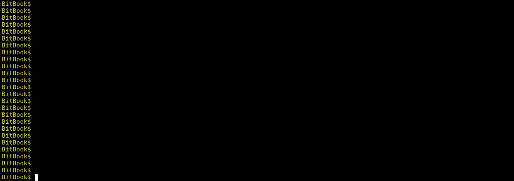

# Example Run
**In the following examples all addresses and transactions are randomly taken from the Bitcoin
blockchain and all ownership details are purely fictional!**



Let's assume you know that at one point you received coins as part of a transaction.
You can query details for this transaction using the command `get-transaction-details`:
```
BitBook$ get-transaction-details da30fbe98d0e21968ec73a995a45291b1795e3006c0dcb432bc5f351b140573f
Transaction:    da30fbe98d0e21968ec73a995a45291b1795e3006c0dcb432bc5f351b140573f
Description:    
Block:          677171 (2021-03-31T16:23:14)
Fees:              0.00023186 [        11.61€]
Inputs:
           3AheoYDgWj3PLGA2XcmuZvyCzbsngz7sXd ?    0.12319446 [     6,170.32€]                     
           39Kyuxzgs4jm61MYgJYeJNHfUq5RanKBHf ?    0.0010374  [        51.96€]                     
Outputs:
           35PWdG8CHar1dUj9RrYBneCyQcN6kzXqFS ?    0.124      [     6,210.66€]         
```

As you can see, with this transaction 0.124 BTC were transferred to address `35PWd...`.

## Mark as owned
Assuming you're the owner of this address, you can mark it as *owned*:

```
BitBook$ mark-address-as-owned 35PWdG8CHar1dUj9RrYBneCyQcN6kzXqFS
OK
```

Notes:
* If the address is already known (in this case because of the `get-transaction-details` invocation above)
  you may use tab completion for the address:
    * `mark-address-as-owned 35PWd<tab>` completes to `mark-address-as-owned 35PWdG8CHar1dUj9RrYBneCyQcN6kzXqFS`
* Instead of `mark-address-as-owned` you can also use the short-hand version `owned`

If you query the transaction details again, the ownership information is displayed next to the
address as indicated by the checkmark `✓` in the output:
```
BitBook$ get-transaction-details da30fbe98d0e21968ec73a995a45291b1795e3006c0dcb432bc5f351b140573f
Transaction:    da30fbe98d0e21968ec73a995a45291b1795e3006c0dcb432bc5f351b140573f
Description:    
Block:          677171 (2021-03-31T16:23:14)
Fees:              0.00023186 [        11.61€]
Inputs:
           3AheoYDgWj3PLGA2XcmuZvyCzbsngz7sXd ?    0.12319446 [     6,170.32€]                     
           39Kyuxzgs4jm61MYgJYeJNHfUq5RanKBHf ?    0.0010374  [        51.96€]                     
Outputs:
           35PWdG8CHar1dUj9RrYBneCyQcN6kzXqFS ✓    0.124      [     6,210.66€]       
```

## Mark as foreign
Similarly, you can mark the input addresses as *foreign* using `mark-address-as-foreign` (or `foreign`):
```
BitBook$ foreign 3AheoYDgWj3PLGA2XcmuZvyCzbsngz7sXd 
OK
BitBook$ foreign 39Kyuxzgs4jm61MYgJYeJNHfUq5RanKBHf 
OK
BitBook$ get-transaction-details da30fbe98d0e21968ec73a995a45291b1795e3006c0dcb432bc5f351b140573f
Transaction:    da30fbe98d0e21968ec73a995a45291b1795e3006c0dcb432bc5f351b140573f
Description:
Block:          677171 (2021-03-31T16:23:14)
Fees:              0.00023186 [        11.61€]
Inputs:
           3AheoYDgWj3PLGA2XcmuZvyCzbsngz7sXd ✗    0.12319446 [     6,170.32€]                     
           39Kyuxzgs4jm61MYgJYeJNHfUq5RanKBHf ✗    0.0010374  [        51.96€]                     
Outputs:
           35PWdG8CHar1dUj9RrYBneCyQcN6kzXqFS ✓    0.124      [     6,210.66€]                  
```

Similarly to the checkmark for owned addresses, foreign addresses are shown with a cross `✗` next to it.

## Neighbour Transactions

With the information provided above, BitBook can automatically find neighbour transactions that connect
your owned address to an address with unknown ownership:

```
BitBook$ get-neighbour-transactions
f74b5dd425497eaabbee8562cf9b41b1f99ba7209d199ca0ac9c0aee4b4804c5:   -0.1238648  [    -6,203.89€] (block 677175, 2021-03-31T17:06:31)
```

In this list you can see that the transaction `f74b...` takes 0.1238648 coins out of your owned
address, and sends these coins to addresses with unknown ownership.

```
BitBook$ get-transaction-details f74b5dd425497eaabbee8562cf9b41b1f99ba7209d199ca0ac9c0aee4b4804c5
Transaction:    f74b5dd425497eaabbee8562cf9b41b1f99ba7209d199ca0ac9c0aee4b4804c5
Description:    
Block:          677175 (2021-03-31T17:06:30)
Fees:              0.0001352  [         6.77€]
Inputs:
           35PWdG8CHar1dUj9RrYBneCyQcN6kzXqFS ✓    0.124      [     6,210.66€]                     
Outputs:
           1ET8va8cJNGGLtG7pwRq79EeE7qNb7ofCS ?    0.1        [     5,008.60€]                     
           36WvZoFtn8ng6V8RyfB76dF73rJD6FLz9a ?    0.0238648  [     1,195.29€]                          
```

*Note that the fees are automatically considered to be spent to a foreign address.
As such, although 0.124 coins are taken out of your address, we only need additional information
about 0.124 - 0.0001352 = 0.1238648 coins.*

Assuming we bought something for 0.1 coins, we can mark the address of the first output as foreign,
and the address of the second output as owned:

```
BitBook$ foreign 1ET8va8cJNGGLtG7pwRq79EeE7qNb7ofCS 
OK
BitBook$ owned 36WvZoFtn8ng6V8RyfB76dF73rJD6FLz9a 
OK
```

By repeating this process (`get-neighbour-transactions`, `get-transaction-details`, `owned`/`foreign`) we can
identify **all** owned addresses connected to the transaction we started with.

At the time of writing this example, the coins in address `36WvZ...` have not been spent, yet.
This can be seen by running `get-address-transactions 36WvZoFtn8ng6V8RyfB76dF73rJD6FLz9a`:

```
BitBook$ get-address-transactions 36WvZoFtn8ng6V8RyfB76dF73rJD6FLz9a
Address: 36WvZoFtn8ng6V8RyfB76dF73rJD6FLz9a ✓
Description: 
Transaction hashes (1):
f74b5dd425497eaabbee8562cf9b41b1f99ba7209d199ca0ac9c0aee4b4804c5:    0.0238648  [     1,195.29€] (block height 677175, 2021-03-31T17:06:30)
```

As such, we are done and have complete ownership information about all owned addresses and connected transactions.

## More Information

Using `list-owned-addresses` you can get an overview of all owned addresses:

```
BitBook$ list-owned-addresses 
           35PWdG8CHar1dUj9RrYBneCyQcN6kzXqFS    0          [         0.00€]                     
           36WvZoFtn8ng6V8RyfB76dF73rJD6FLz9a    0.0238648  [     1,127.22€]     
```

With `get-balance` you can get the balance summed over all of your owned addresses:

```
BitBook$ get-balance
   0.0238648  [     1,127.22€]
```

If you need to remove ownership information for an address, you can use the command `reset-ownership`:
```
BitBook$ reset-ownership 1ET8va8cJNGGLtG7pwRq79EeE7qNb7ofCS 
OK
```

## Address Descriptions
It is possible to add descriptions to addresses.
This can help to identify different wallets
(phone, coldstorage, laptop, ...), or add information about foreign addresses
(exchange name, personal contact, ...).
To set a description for an address, you may use the command `set-address-description`:

```
BitBook$ set-address-description 1ET8va8cJNGGLtG7pwRq79EeE7qNb7ofCS "Pete Peterson"
OK
```

You may also provide a description with `mark-address-as-owned`/`owned`/`mark-address-as-foreign`/`foreign`:

```
BitBook$ foreign 1ET8va8cJNGGLtG7pwRq79EeE7qNb7ofCS "Pete Peterson"
OK
```

Address descriptions are supported in address tab completion (`get-address-transactions Pete<tab>`).
Furthermore, the description is shown anytime the address is presented to the user:
```
BitBook$ get-transaction-details f74b5dd425497eaabbee8562cf9b41b1f99ba7209d199ca0ac9c0aee4b4804c5
Transaction:    f74b5dd425497eaabbee8562cf9b41b1f99ba7209d199ca0ac9c0aee4b4804c5
Description:    
Block:          677175 (2021-03-31T17:06:30)
Fees:              0.0001352  [         6.77€]
Inputs:
           35PWdG8CHar1dUj9RrYBneCyQcN6kzXqFS ✓    0.124      [     6,210.66€]                     
Outputs:
           1ET8va8cJNGGLtG7pwRq79EeE7qNb7ofCS ✗    0.1        [     5,008.60€] Pete Peterson
           36WvZoFtn8ng6V8RyfB76dF73rJD6FLz9a ✓    0.0238648  [     1,195.29€]                     
```

To remove a description, use `remove-address-description`:
```
BitBook$ remove-address-description 1ET8va8cJNGGLtG7pwRq79EeE7qNb7ofCS
OK
```

### Transaction Descriptions
Similary, you can also set a description for a transaction:

```
set-transaction-description f74b5dd425497eaabbee8562cf9b41b1f99ba7209d199ca0ac9c0aee4b4804c5 "Stuff from Pete"
```

This information is then included whenever the transaction hash is shown:

```
BitBook$ get-address-transactions 36WvZoFtn8ng6V8RyfB76dF73rJD6FLz9a
Address: 36WvZoFtn8ng6V8RyfB76dF73rJD6FLz9a ✓
Description: 
Transaction hashes (1):
f74b5dd425497eaabbee8562cf9b41b1f99ba7209d199ca0ac9c0aee4b4804c5:    0.0238648  [     1,195.29€] (block height 677175, 2021-03-31T17:06:30) Stuff from Pete
```

To remove a description, use `remove-transaction-description`:

```
BitBook$ remove-transaction-description f74b5dd425497eaabbee8562cf9b41b1f99ba7209d199ca0ac9c0aee4b4804c5
OK
```