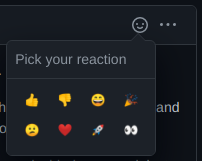

# Feature Requests and Bug Reports
BitBook doesn't have a lot of features, and several apparent flaws.
Please have a look at the existing issues, leave feedback, and create issues yourself!
I need to know how YOU think about BitBook, so that I can help create the product you need
or want to use.

Please have a look at the [list of known issues](https://github.com/C-Otto/BitBook/issues).

## Upvote Issues
If you have a GitHub account, please make use of the emoji reactions which you can find in the top
right corner of each issue (and comment). If you leave a "thumbs up", I know that you're
interested in the feature/fix!

## Create Issue
If you found something that didn't work as expected, or if you'd like to see something that doesn't exist, yet: please
create a new GitHub issue!

[Create a new issue](https://github.com/C-Otto/BitBook/issues/new/choose)